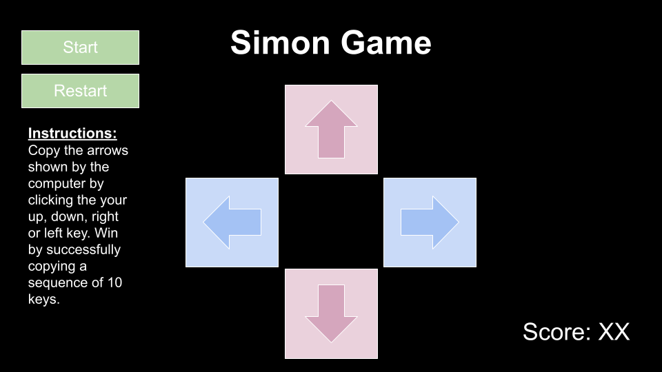

# Simon Dance Game
My game is inspired by Simon and Dance, Dance, Revolution, in which the computer shows a sequence of keys to press, and the player has to copy it on their own keyboard step by step. It will keep a score of how many keys the player has succesfully remembered and copied; the player wins when they succesfully copy a sequence of 10 keys (a score of 10).

## Wire Stories
### Landing Page

### Winning Page

## User Story

### MVP
- As a user, I want to see a landing page that let's me know I'm at the right place.
- As a user, I want to see a start button, so I won't miss the start of the game.
- As a user, I want to see 4 images that clearly symbolize the up, down, left and right keys, and for them to react accordingly to what I type.
- As a user, I want a visual and auditory signifier that will show me what sequence of leys I must type (i.e. color of button changes, opacity goes up, etc...)
- As a user, I want to see the same visual and auditory signifier when typing a key.
- As a user, I want the game to start with one button, wait for me to copy, then add to the sequence bit by bit.
- As a user, I want the game to not change, but simply add on to its current sequence until I lose.
- As a user, I want to see my points keeping track every time I copy the sequence right.
- As a user, I want to see a "game over" message and a restart button when I lose.
- As a user, I want to see a "winner" message when I have succesfully copied a sequence of 10 keys.

### Stretch Goals
- As a user, I want to play for an infinite amount of time. The game only stops when I lose and there is no winning.
- As a user, I want my high score to be stored and saved in the "infinite" version.
- As a user, I want there to be a "hard" version in which diagonal buttons are an option (pressing two buttons at the same time).
- As a user, I want the design to resemble the original DDR game.
- As a user, I want a dancing mascot which reacts to every clicked button.

## Pseudocode

```
// 1. Define variables for:
    // the computer's sequence (array)
    // the player's sequence (array)
    // the player's score
    // options (array) with button directions
    // key count = 0 

// 2. Save cache element for  game message.

// 3. Add event listeners to:
    // start button
    // up element
    // down element
    // right element
    // left element
    // restart element

// 4. Create startGame() function, which calls init(). Call this when clicking the start button through an event listener.

// 5. Create an init() function which will keep track of all the variables.
    // at game start: set computer and player sequence, score and game message empty.
    // call updateComputerSequence()
    // call a render() function to update all variables

// 6. Create a render() function:
    // set key count to 0
    // calls updateScore()
    // calls checkWin()

// 7. Create a updateComputerSequence() function:
    // randomly chooses a button to start sequence from choices array
    // activates chosen button with visual and auditory signifier
    // saves choice to computer sequence array

// 8. Create an updatePlayerSequence() function:
    // use event listeners from buttons to save player's choice in the player's sequence array AND add 1 to key count
    // also activate visual and auditory signifier through event listener
    // IF key count matches the computer sequence's arrat length, call render()

// 9. Create an updateScore() function which adds 1 to player's score IF player sequence array matches computer sequence array.

// 10. Create checkWin() function:
    //  IF score = 10, set game message to congratulatory message.
    // ELSE IF the game sequence and player sequence don't match, set game message to losing message.
    // ELSE IF call updateComputerSequence().

// 11. Call init() when reset button is clicked through event listener.
```