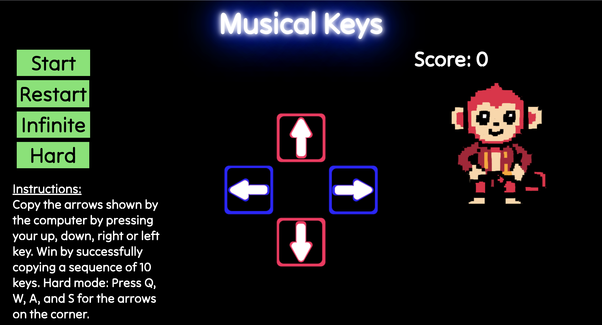
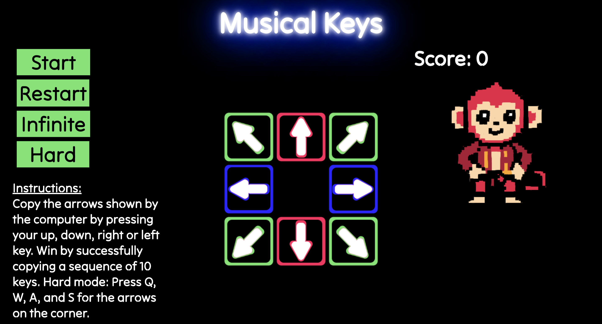

# Musical Keys

This game is similar to Simon Says, the program will show a sequence of buttons for the player to succesfully copy. The player copies this sequence through using the arrows on their keyboard. In the standard version, the player has to succesfully copy a sequence of 10 to win. The infinite mode allows them to play for however long they want with a high score. The hard mode adds 4 more arrows, which are copyable through the Q, W, A, and S keys. The player can play hard mode and infinite mode at the same time if they want to. Also, there's a dancing monkey.

> This is the hard mode.

You can play the game on desktop here: https://stella-teu.github.io/musical-keys-game/

**Technologies used:** JavaScript, HTML, CSS, Photoshop, ChatGPT (specifically Drawing Upgrader by Ivo Treder)

## Next Steps
To improve the game, I'd like to add a timer version, in which the player has limited time to copy the sequence. The program would also go faster. I also want to see if I could include real songs to play with the keys.